# Perception

桌面可视化工具，对标 **ParaView** 与 **Synopsys svisual**（Inspect / Visual）。
当前聚焦于**界面层**——主窗口、Dock 重组、主题系统、内嵌 Python 控制台；
数据层（VTK 渲染、文件解析）随后接入。


*默认 Dark Classic 主题：左侧 Data 面板、右侧 Properties 面板、底部 Python Console
（内嵌 CPython 3.13 REPL，支持多行粘贴即执行）。*

## Screenshots

### Python console


`import sys` → `sys.version` 自动求值显示完整 Python 版本字符串。

### Dock floating / restored

| Floating | Restored |
|---|---|
|  |  |

Frameless floating window (`– □ ↗ ×`) and double-click title bar to restore.

### Theme gallery (25 themes)

> Dark → Light → High Contrast, same order as the Theme menu.

| Dark | | | |
|---|---|---|---|
| 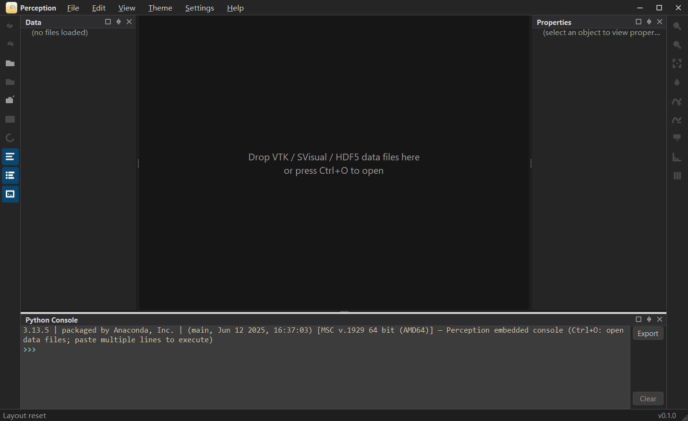 | 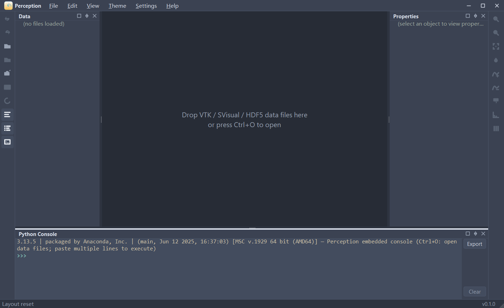 | 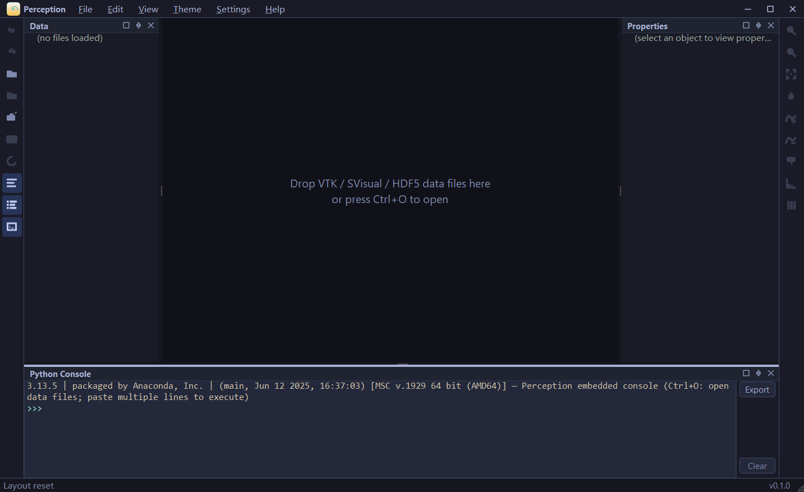 | 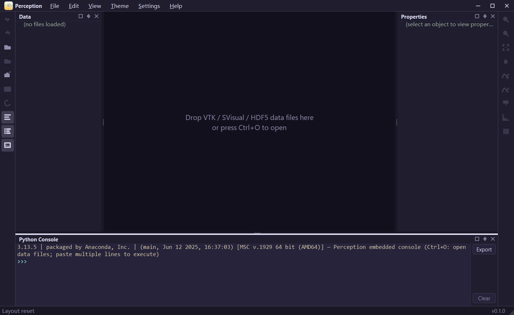 |
| **Dark Classic** (default) | Nord | Tokyo Night | Rosé Pine |
| 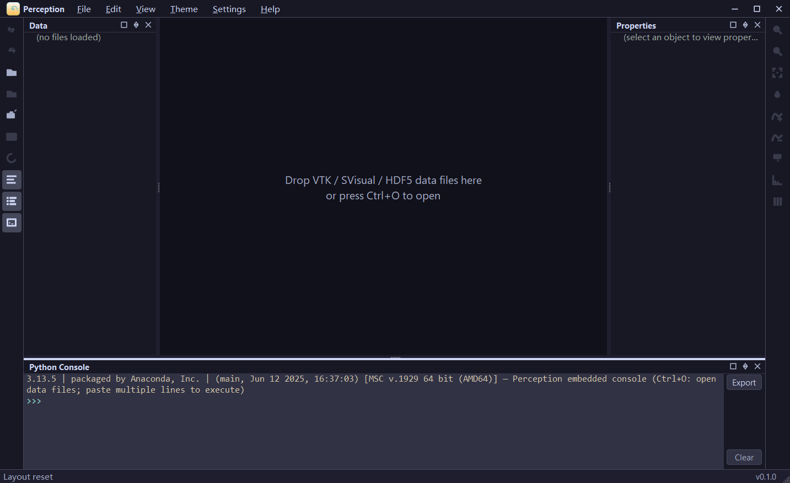 | 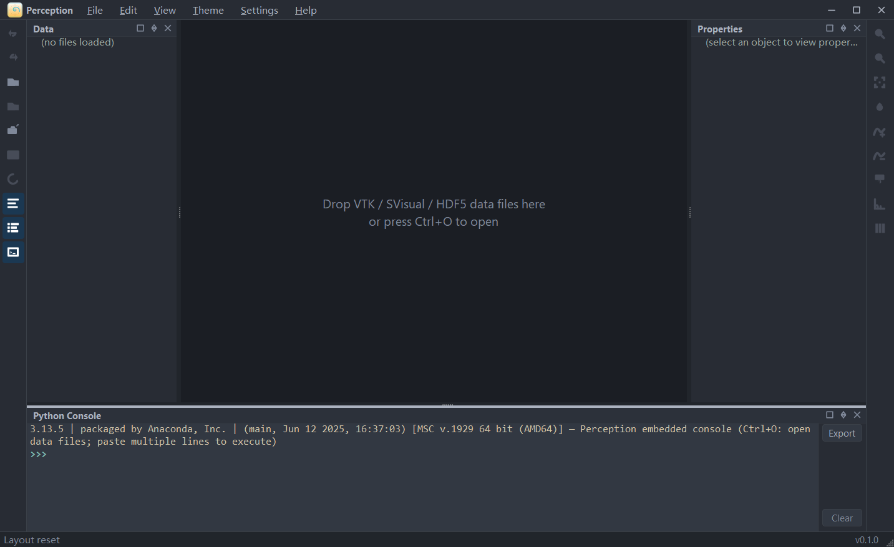 | 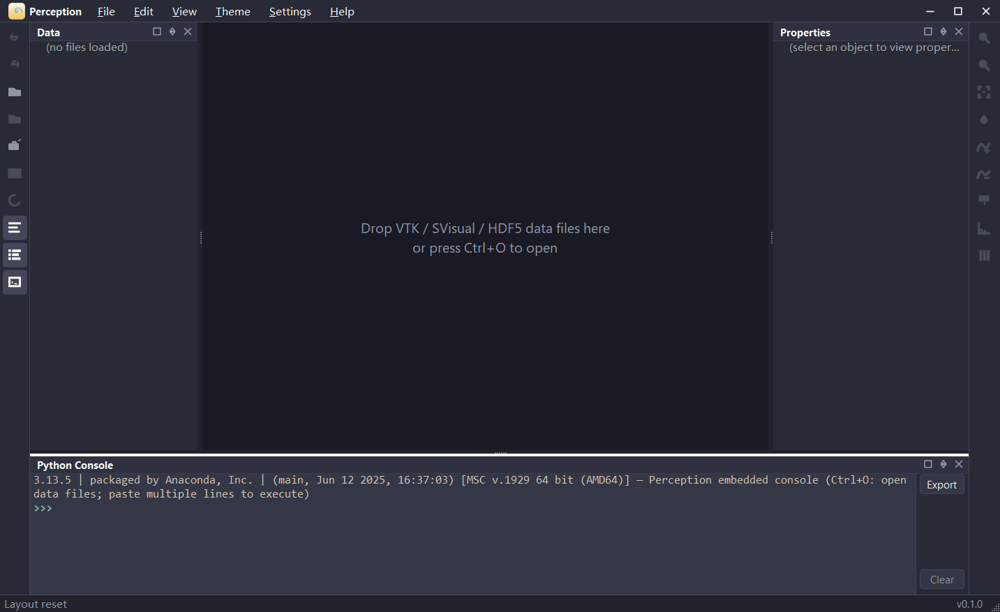 | 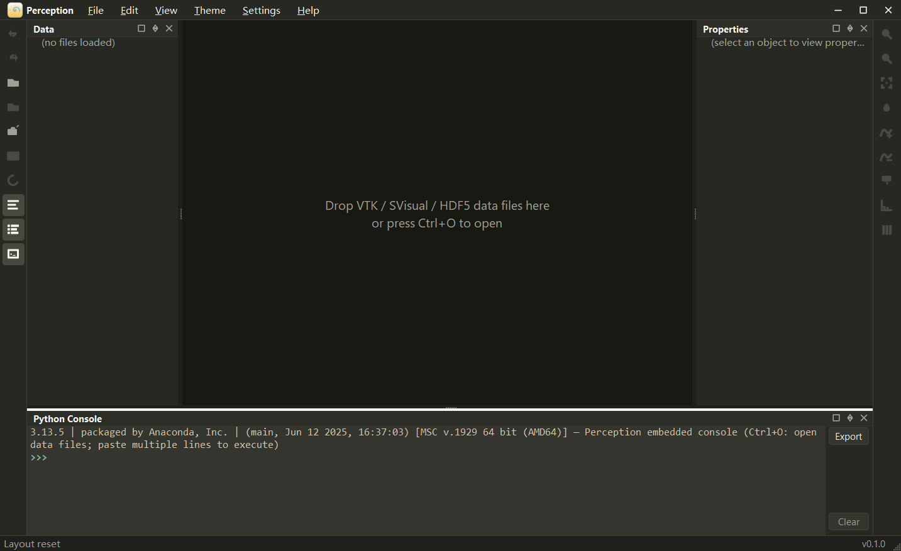 |
| Catppuccin Mocha | One Dark | Dracula | Monokai |

| Light | | | |
|---|---|---|---|
| 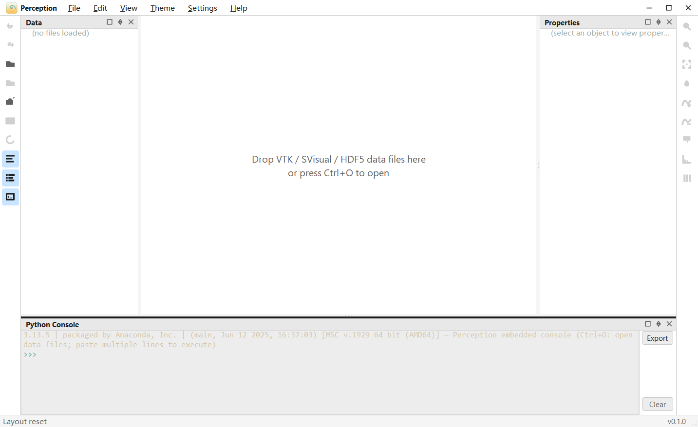 | 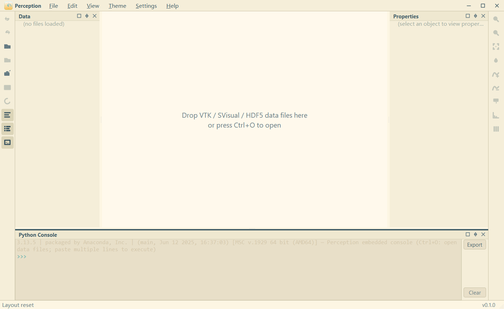 | 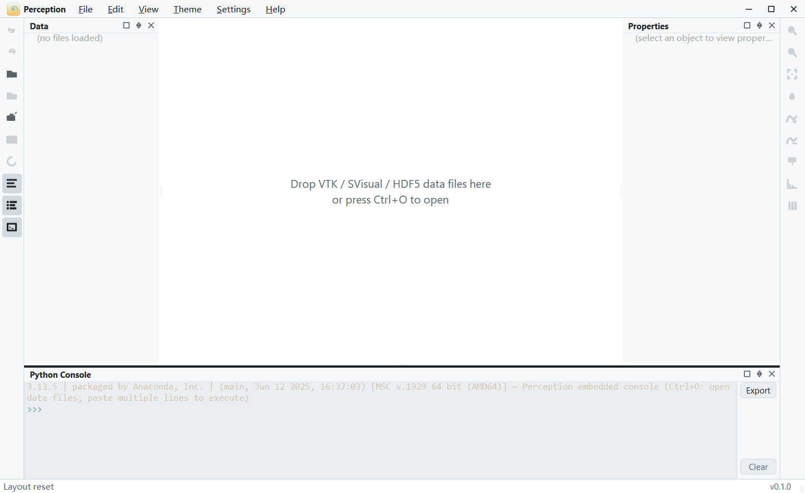 | 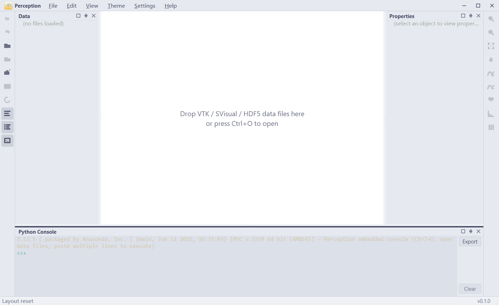 |
| **Light Classic** | Solarized Light | GitHub Light | Catppuccin Latte |

| High Contrast | | |
|---|---|---|
| 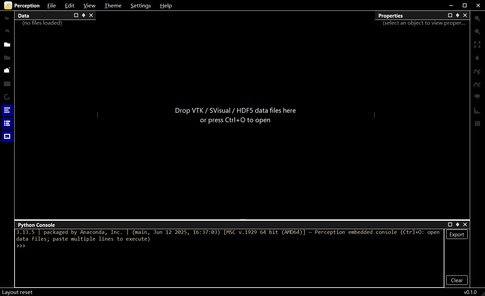 | 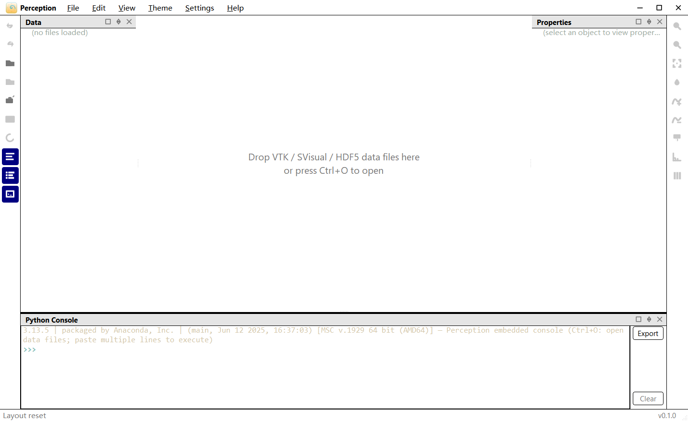 | 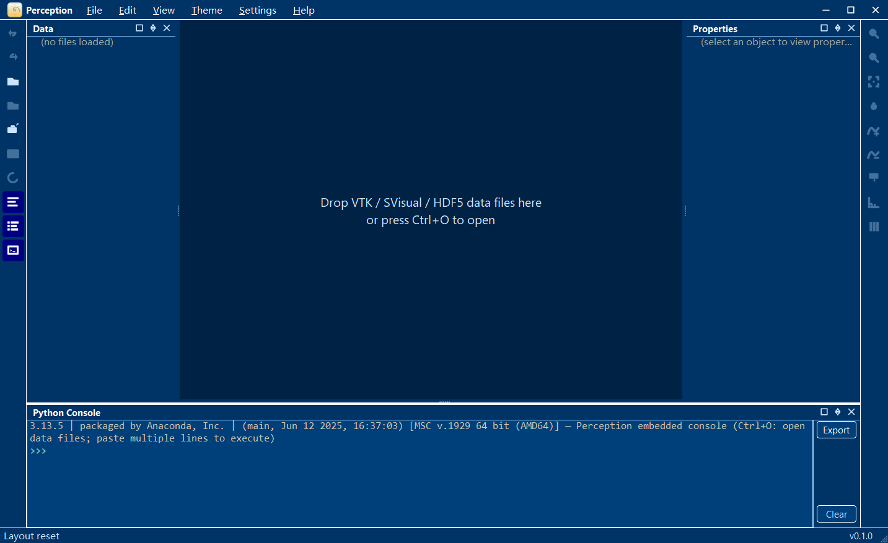 |
| HC Black | HC White | HC Blue |

All 25 themes (dark-classic / dark-blue / nord / one-dark / dracula / monokai /
gruvbox-dark / solarized-dark / tokyo-night / rose-pine / catppuccin-mocha /
everforest-dark / kanagawa / night-owl / ayu-dark / light-classic / light-blue /
material-light / solarized-light / rose-pine-dawn / catppuccin-latte / github-light /
hc-black / hc-white / hc-blue) live in `docs/screenshots/themes/`.

## Features

**Shipped (M3a UI framework)**

- **Main window**: menu bar (File / Edit / View / Theme / Settings / Help) + toolbar + status bar
- **3 docks**: Data (left), Properties (right), Python Console (bottom) — drag to rearrange
- **Frameless floating windows**: minimize / maximize / restore-embed / close + bottom-right resize handle
- **25 themes**: 15 Dark + 7 Light + 3 High Contrast; hot-swap, persisted to QSettings
- **Embedded Python REPL**: CPython 3.13 via pybind11; expression auto-eval, multi-line
  continuation prompts, syntax / runtime tracebacks; multi-line paste = execute; Export / Clear
- **Logging**: colored terminal sink + Qt message redirection (`qDebug/qWarning` into unified stream)
- **Open file dialog filter**: VTK (`*.vtk *.vti *.vtp *.vtu *.vts *.vtr`) /
  SVisual (`*.plt *.tdr`) / HDF5 (`*.h5 *.hdf5`) / Curve Data (`*.csv *.dat`)

**Roadmap (M3b+ data layer)**

- File readers: pluggable via `core/io/reader.h`; `.plt` / `.csv` registered today;
  new formats (full VTK / HDF5 / extended SVisual) = new reader
- VTK Charts 2D curve rendering (`src/render/`)
- pybind command layer (`src/python/`): `load_plt / transform / query / export`

## Tech stack

- C++17 / Qt 5.15.2 / VTK 9.4.1 / pybind11 / CPython 3.13

## Layout

```
src/
├─ core/               Data core (no UI deps, unit-testable)
│  ├─ model/           Format-agnostic data model: curves (IDataSet/Curve) + structures (IStructure/FieldData)
│  ├─ io/              File readers + registry (.plt/.csv curves; .tdr structures; new format = new reader)
│  ├─ process/         Data processing: transform pipeline (unit_scale, etc.)
│  └─ event/           Event bus (pub-sub)
├─ render/             Render layer: VTK Charts 2D curves (M3b)
├─ ui/                 UI layer: Qt5 Widgets + Dock + QSS theme system
│  ├─ theme/           25 themes (QSS + QPalette + menu groups)
│  ├─ console/         PythonConsole: REPL, continuation, tracebacks, Export
│  ├─ design/          Floating window / dock decorator
│  └─ icon/            action_icon_map (icon → toolbar / menu / file type)
├─ app/                Entry: main.cpp + snapshot debug flags
└─ python/             pybind command layer (M5)
tests/
├─ cpp/                C++ unit tests (CTest, core layer, no UI deps)
└─ python/             pytest (command layer tests, M5+ depends on perception_py)
docs/
├─ design/             Design (mockups / icon-spec / ui-guidelines)
└─ screenshots/        Screenshots (regenerated by scripts/update_screenshots.ps1)
```

## Milestones

| Milestone | Content | Status |
|---|---|---|
| M0 | Repo cleanup + skeleton | Done |
| M1 | `src/core/io`: .plt parser + unit tests | Todo (parallel with M3a) |
| M2 | Design (local mockup) + structure data model | Todo |
| M3a | **UI framework**: main window + docks + 25 themes + Python console + float/restore | Done |
| M3b | End-to-end MVP: UI + reader + curve render | Next |
| M4 | `src/render`: VTK curve render (merged into M3b) | — |
| M5 | `src/python`: pybind command layer | Todo |
| M6 | Packaging + docs | Todo |

## Build

> Requires CMake ≥ 3.16, VS2022 + Ninja, Qt 5.15.2 (msvc2019_64), VTK 9.4.1 (Qt5 prebuilt).

### Skeleton mode (no Qt/VTK; M0 + M1 + core tests only)

```powershell
cmake -B build -G Ninja
cmake --build build
ctest --test-dir build --output-on-failure
```

### GUI mode (M3a and beyond)

```powershell
.\scripts\build.ps1 -Gui
```

Optional `-Qt5Dir "<...>"` / `-VtkDir "<...>"` / `-Pytest` to override paths and run Python tests.

Output: `bin\Release\perception.exe` (multi-config generator auto-adds `<Config>` subdir).

### Run

```powershell
.\bin\Release\perception.exe
```

### Regenerate screenshots

All images under `docs/screenshots/` are produced by `scripts/update_screenshots.ps1`,
which drives `bin\Release/perception.exe` with `--snapshot` / `--snapshot-float` /
`--theme` / `--console-script` debug flags (~39 launches, 1-3 min):

```powershell
.\scripts\update_screenshots.ps1
```

Re-run after any UI change to keep the gallery in sync.

### Clean

```powershell
.\scripts\clean.ps1         # interactive confirmation
.\scripts\clean.ps1 -Force  # skip confirmation
.\scripts\clean.ps1 -WhatIf # preview only
```

Removes `build\` / `bin\` / `lib\` and Python caches; keeps source / spec / docs / `third-party\`.

## Tests

- **C++** (CTest): `tests/cpp/`, core logic, headless
- **pytest**: `tests/python/`, command chain load → transform → query → export (M5+)

## Workflow

Follows the `spec-kit` spec-gate pipeline (`.specify/`); designs are injected via local
mockups (`docs/design/mockups/`), no remote design service. Architectural constraints
live in `.specify/memory/constitution.md` v1.1.
