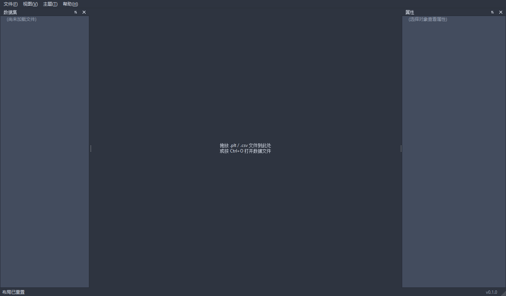
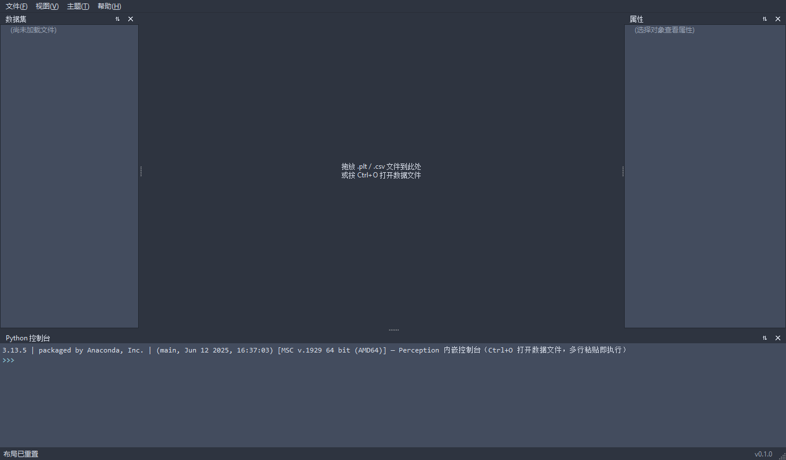
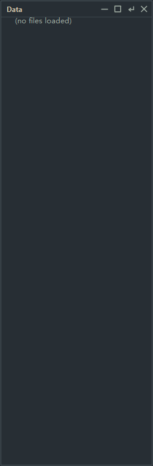

# Perception

数据可视化桌面工具，对标 **ParaView** 与 **Synopsys svisual**（Inspect / Visual），服务半导体仿真工程师（.plt 曲线 / .tdr 结构查看）。

**当前状态**：UI 框架（主窗口 / Dock / 主题系统 / 内嵌 Python 控制台）与数据核心（数据模型 / .plt/.csv 读取 / 变换 / 事件总线）已就绪；VTK 曲线渲染与端到端数据链路（M3b）进行中。



*默认 Dark Classic 主题：左侧 Data 面板、右侧 Properties 面板、底部 Python Console（内嵌 CPython 3.13 REPL）。*

## 功能特性

- **主窗口**：菜单栏（File / Edit / View / Theme / Settings / Help）+ 工具栏 + 状态栏
- **三 Dock**：Data（左）、Properties（右）、Python Console（底）——可拖拽重组
- **无边框浮动窗口**：最小化 / 最大化 / 还原嵌入 / 关闭 + 右下角缩放；多屏最大化
- **25 主题**：15 深色 + 7 浅色 + 3 高对比；热切换并持久化到 QSettings
- **内嵌 Python REPL**：CPython 3.13 + pybind11；表达式自动求值、多行续行、语法/运行时 traceback、多行粘贴即执行、导出 / 清空
- **统一日志**：彩色终端输出 + Qt 消息重定向（`qDebug/qWarning` 汇入同一流）
- **图标体系**：59 枚功能图标采用 Google Material Icons Outlined（Apache-2.0，本地化 SVG 源）+ 多尺寸 PNG/ICO，按功能区映射到菜单 / 工具栏 / 文件类型
<!-- sync_file_types:start -->
- **打开文件过滤**：VTK（`*.vtk *.vti *.vtp *.vtu *.vts *.vtr *.vtm *.vtmb *.vth *.vto *.pvti *.pvtp *.pvtu *.pvts *.pvtr *.pvtm *.pvd`） / SVisual（`*.plt *.tdr`） / HDF5（`*.h5 *.hdf5`） / 曲线（`*.csv *.dat *.plt`）
<!-- sync_file_types:end -->

## 工程架构

四层结构与两条驱动原则（完整版见 [docs/architecture.md](docs/architecture.md)）：

```
        ┌──────────── core（数据核心，无 UI/渲染依赖）───────────┐
        │  model（数据模型） ← io（格式读取器） ← process（变换） │
        │         ↑                        ↑                    │
        │         └──────── event（事件总线）────────────────────┘
        │                  │ 发布
        ├──────────────────┼────────────────────────────────────┤
        │                  ↓ 订阅                                  │
        │  render（VTK 渲染）    ui（Qt Widgets）                  │
        │         \             /                                 │
        │          app（入口，内嵌 Python）                         │
        └──── python（pybind 命令层：load_plt / transform / query / export）──┘
```

- **事件驱动**：`render` / `ui` 订阅 `core/event/` 总线（`DataSetChanged`、`StructureChanged`、`SelectionChanged` 等），数据变更自动刷新，**禁止轮询或直接操作核心数据**。
- **命令驱动**：所有数据处理操作（加载 / 增删曲线 / 变换 / 查询 / 导出）必须经 `src/python/` 命令层执行，UI 只翻译为命令调用；纯 UI 变化（布局 / 主题 / 面板）除外。
- **前后端分离**：`ui` 只持有展示抽象（如 `ICurveChart`），不接触原始 VTK / 数据内部；VTK 仅出现在 `src/render/`。
- **格式可扩展**：新文件格式 = 在 `core/io/readers` 注册新 reader，`model` 与消费者零改动。

## 目录结构

```
src/
├─ core/              数据核心（无 UI 依赖，可独立单测）
│  ├─ model/          IDataSet/Curve（曲线）+ IStructure/FieldData（结构）
│  ├─ io/             格式读取器 + 注册表（.plt / .csv 已实现）
│  ├─ process/        数据处理变换管道
│  ├─ event/          事件总线（发布-订阅）
│  └─ log/            统一日志（001-unified-logging）
├─ render/            VTK 渲染层（M3b，进行中）
├─ ui/                Qt Widgets：theme（25 主题）/ console（Python REPL）/
│                     dock / subwindow / frameless / icon / log 等
├─ app/               入口 main.cpp + 快照调试参数
└─ python/            pybind 命令层：api / command / console
tests/
├─ cpp/               C++ 单元测试（CTest，core 层，无头可跑）
└─ python/            pytest（命令层测试）
docs/
├─ architecture.md   分层 / 依赖方向 / 数据流
├─ design.md         设计入口（规则源：ui-guidelines.md；视觉源：mockups/）
├─ prd.md            产品规划
├─ design/           图标规范 / UI 规范 / mockups（本地设计源）
└─ screenshots/       截图（由 scripts/update_screenshots.ps1 重生成）
```

## 脚本工具（scripts/）

全部 11 个脚本均有明确用途，分三类：

### 构建与产物

| 脚本 | 用途 | 用法 |
|---|---|---|
| `build.ps1` | CMake 配置 + 编译 + 可选 CTest / pytest；`-Gui` 构建 Qt/VTK 界面层 | `.\scripts\build.ps1 -Gui -UnitTests -Pytest` |
| `clean.ps1` | 清理 `build\` / `bin\` / `lib\` 与 Python 缓存，恢复「克隆即构建」 | `.\scripts\clean.ps1 [-Force] [-WhatIf]` |
| `update_screenshots.ps1` | 驱动 `perception.exe --snapshot` 重生成 `docs/screenshots/` 全部截图 | `.\scripts\update_screenshots.ps1` |

### 质量门禁（合并前自查）

| 脚本 | 用途 | 用法 |
|---|---|---|
| `format_all.ps1` | clang-format 全库格式化；`-Check` 为 dry-run 门禁（非零退出） | `.\scripts\format_all.ps1 [-Check]` |
| `check_line_counts.ps1` | 行数红线门禁：`.cpp` ≤ 800 / `.h` 红线 500（建议 300）/ `.hpp` ≤ 800 | `.\scripts\check_line_counts.ps1` |
| `check_pragma_once.ps1` | 扫描 `src/` 与 `tests/cpp/`，检测缺失 `#pragma once` 的头文件 | `.\scripts\check_pragma_once.ps1` |
| `check_icons.py` | 图标规范校验：色板 Token 白名单 / 命名规则 / icon-map 覆盖 / 字段 schema | `python scripts\check_icons.py` |
| `check_theme_contrast.py` | 解析 `theme_catalog*.h`（dark/light/hc 拆分后目录），按 WCAG 校验文字/图标对比度 | `python scripts\check_theme_contrast.py` |

### 图标设计管线

| 脚本 | 用途 | 用法 |
|---|---|---|
| `render_icons.py` | SVG → PNG（功能图标 16/24/32 px；应用图标含 `.ico` 合成） | `python scripts\render_icons.py` |
| `gen_qrc.py` | 由已渲染 PNG 生成 `theme.qrc` 图标资源条目 | `python scripts\gen_qrc.py` |
| `make_mockups.py` | 生成图标集总览 / 图标栏 / 主窗口 mockup 预览图（`docs/design/mockups/005-icon-set`） | `python scripts\make_mockups.py` |

> 依赖提示：门禁脚本需要 `clang-format`（LLVM）；图标脚本需要 `PyQt5` / `PyYAML` / `Pillow`。构建与测试需要 VS2022 + Qt 5.15.2（msvc2019_64）+ VTK 9.4.1（Qt5 预建版），默认路径已固化在 `CMakeLists.txt`。

## 构建与测试

> 前置：CMake ≥ 3.16、VS2022 + Ninja、Qt 5.15.2、VTK 9.4.1。依赖路径统一在 `CMakeLists.txt` 顶部配置（`Qt5_DIR` / `VTK_DIR` / `Python3_ROOT_DIR`）。

### 完整构建（GUI）+ 全部测试

```powershell
.\scripts\build.ps1 -Gui -UnitTests -Pytest
```

### 仅核心层（无 Qt/VTK）

```powershell
cmake -B build -G Ninja
cmake --build build
ctest --test-dir build --output-on-failure
```

### 只跑测试

```powershell
ctest --test-dir build -C Release --output-on-failure   # C++（CTest）
python -m pytest tests\python -v                        # Python（pytest）
```

### 运行

```powershell
.\bin\Release\perception.exe
```

### 重生成截图

```powershell
.\scripts\update_screenshots.ps1
```

UI / 主题改动后合并前必须重生成截图，并与 `docs/design/mockups/` 对比。

### 清理

```powershell
.\scripts\clean.ps1           # 交互确认
.\scripts\clean.ps1 -Force    # 免确认
.\scripts\clean.ps1 -WhatIf   # 仅预览
```

## 截图

### Python 控制台



`import sys` → `sys.version` 自动求值显示完整 Python 版本字符串。

### Dock 浮动 / 还原

| 浮动 | 还原 |
|---|---|
|  |  |

无边框浮动窗口（`– □ ↗ ×`），双击标题栏还原嵌入。

### 主题画廊

全部 25 主题（15 深色 + 7 浅色 + 3 高对比）截图见 `docs/screenshots/themes/`（与 Theme 菜单同序），更多截图见 `docs/screenshots/`。

## 里程碑

| 里程碑 | 内容 | 状态 |
|---|---|---|
| M0 | 仓库清理 + 骨架 | Done |
| M1 | `src/core`：数据模型 + .plt/.csv 读取器 + CTest | Done |
| M2 | 设计（本地 mockup）+ 结构数据模型（IStructure/FieldData） | Done |
| M3a | **UI 框架**：主窗口 + Dock + 25 主题 + Python 控制台 + 浮动/还原 | Done |
| M3b | 端到端 MVP：UI + 读取器 + VTK 曲线渲染（`src/render/`） | Next |
| M4 | `src/render` VTK 曲线渲染（并入 M3b） | — |
| M5 | `src/python` pybind 命令层（load_plt / transform / query / export） | Done（骨架 + 命令注册） |
| M6 | 打包 + 文档完善 | Todo |

> 已落地功能对应 specs：001-unified-logging / 002-icon-design / 003-install-icon-bars / 004-dock-layout-manager / 005-multi-screen-maximize / 006-constitution-refactor。

## 文档导航

| 文档 | 内容 |
|---|---|
| [docs/prd.md](docs/prd.md) | 产品规划与范围 |
| [docs/architecture.md](docs/architecture.md) | 工程架构：分层 / 依赖方向 / 数据流 |
| [docs/design.md](docs/design.md) | 设计入口（视觉稿与规则源） |
| [docs/design/ui-guidelines.md](docs/design/ui-guidelines.md) | UI 设计系统（规则层唯一事实源） |
| [docs/design/mockups/](docs/design/mockups/) | 本地视觉稿（UI 设计源，无远程设计服务） |
| [docs/design/icon-spec.md](docs/design/icon-spec.md) | 图标设计规范与校验流程 |
| [CONTRIBUTING.md](CONTRIBUTING.md) | 软规范：分支 / commit / PR / 代码风格 / 命令速查 |
| [.specify/memory/constitution.md](.specify/memory/constitution.md) | 项目宪法（硬性约束，优先于一切；版本号见文件头部） |
