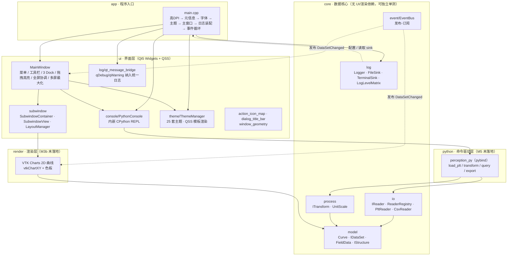
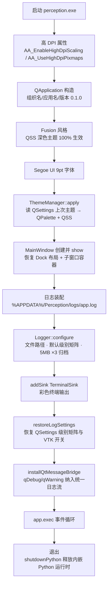
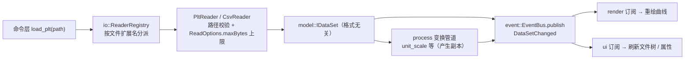
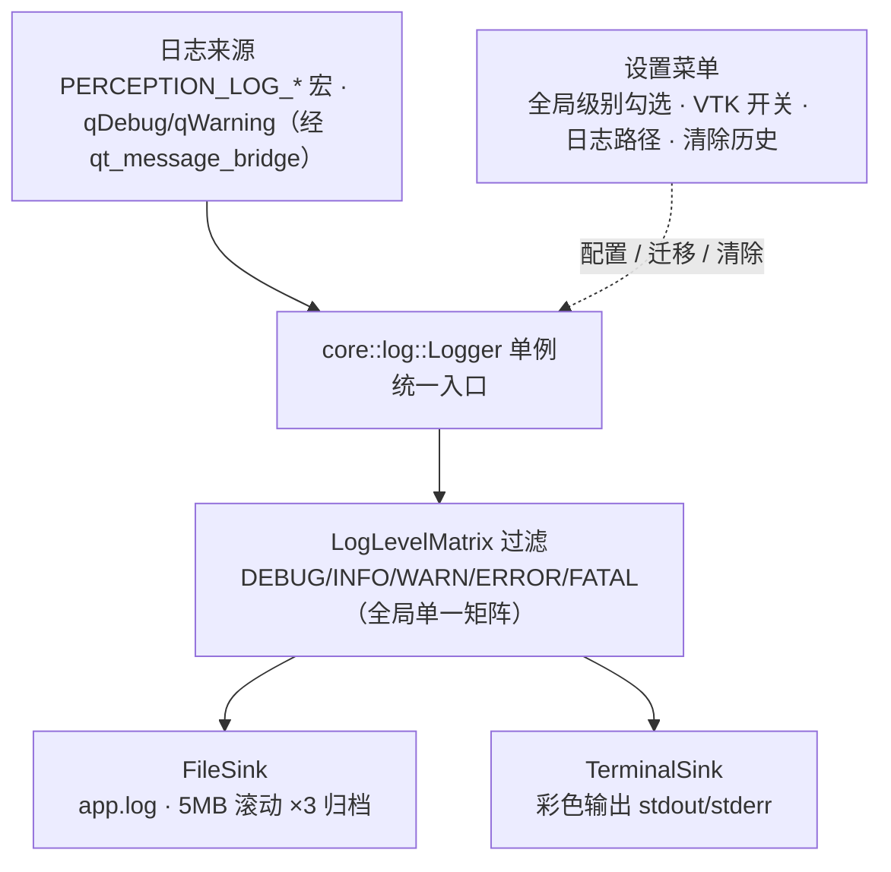
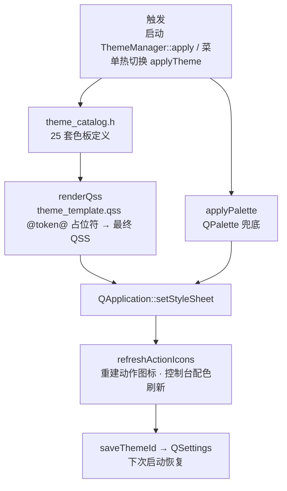
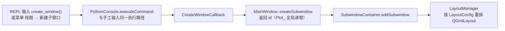
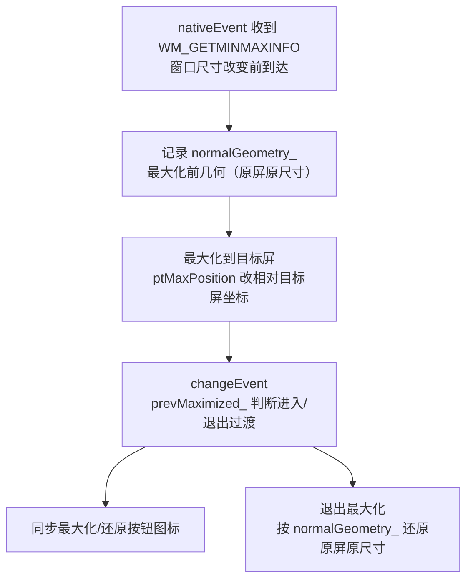
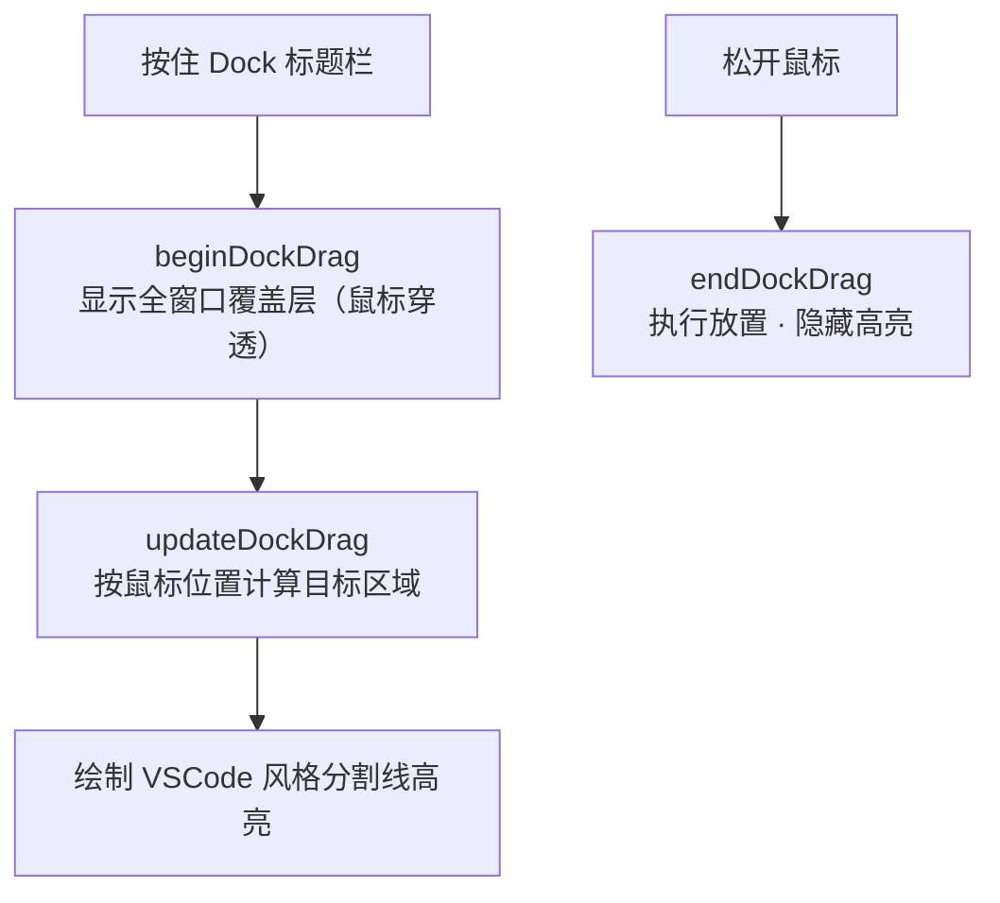

# Perception 架构流程图

> 用 Mermaid 描述项目整体逻辑，与 [architecture.md](../architecture.md) 互为补充。
> Mermaid 可直接在 GitHub 渲染；VS Code 需安装 Mermaid 预览插件。
> 图例：── 实线 = 直接依赖 / 调用；┄┄ 虚线 = 事件订阅 / 发布。

## 1. 模块分层与依赖

要点：

- **core 不依赖任何 UI/渲染库**，独立可单测（CTest）；render 只依赖 core + VTK；ui 依赖 core + Qt。
- **事件驱动**：render / ui 只订阅 `event/EventBus` 刷新画面，不直接轮询 core。
- **命令驱动**（规划）：数据 CRUD 全部经 `python/` 命令层；ui 的数据操作翻译为 Python 命令，纯 UI 变化（布局 / 主题 / 面板）例外。
- **格式可扩展**：新曲线格式 = 新增 `ICurveReader` 并注册，核心与消费者零改动。

## 2. 程序启动流程（src/app/main.cpp）

调试参数（`--snapshot` / `--theme` / `--console-script` / `--subwindows` 等）在进入事件循环后经 `QTimer::singleShot` 驱动，用于截图回归。

## 3. 数据加载与事件驱动

规则：数据变更必须先 `publish` 再返回；回调中避免再次发布同类型事件（`ScopedSubscription` RAII 防悬挂回调）。

## 4. 日志系统（M4 统一日志）

## 5. 主题系统（25 套）

## 6. UI 交互

### 6.1 子窗口创建（004-dock-layout-manager）

子窗口支持：容器内最大化 / 隐藏（View 菜单恢复）/ 最大化窗口前后循环切换；全屏由 MainWindow 隐藏三个 Dock 使容器扩展占满主界面。

### 6.2 多屏最大化（005-multi-screen-maximize）

修复要点：`ptMaxPosition` 必须以**目标屏**的虚拟桌面坐标为准，而非主屏，否则副屏最大化后窗口会"消失"在屏幕外。

### 6.3 Dock 拖拽高亮

分界线（dock 边缘分隔条）resize 拖拽复用同类覆盖层，高亮条只覆盖分隔条缝隙，局部重绘不卡顿。
