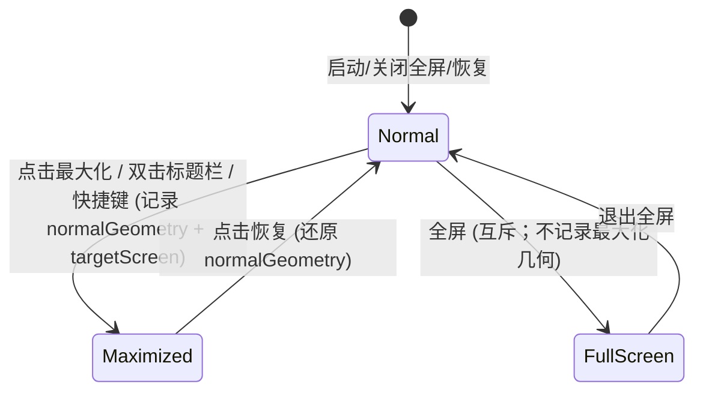

# Data Model: Multi-Screen Maximize

**Branch**: `005-multi-screen-maximize` | **Date**: 2026-08-28

本功能为窗口行为修复，无业务数据实体与持久化需求。仅定义**会话内窗口状态模型**，用于最大化/恢复的几何管理（对应 spec 的 FR-003/FR-006）。

## 实体：WindowLayoutState（会话内，非持久化）

| 字段 | 类型 | 含义 | 校验规则 |
|------|------|------|----------|
| `normalGeometry` | QRect（DIP） | 进入最大化前的窗口位置与尺寸（普通态） | 非空；完整位于解析所得目标屏幕的可用区域内（无越界） |
| `targetScreen` | QScreen* | 本次最大化解析出的目标屏幕（窗口主体所在屏） | 非空（fallback 链保证）；其 `availableGeometry` 与最大化几何一致 |
| `isMaximized` | bool | 当前是否处于最大化态 | 与窗口实际状态一致 |
| `isFullScreen` | bool | 当前是否处于全屏态（互斥于最大化） | 与窗口实际状态一致 |

### 生命周期

| 阶段 | 时机 | 动作 |
|------|------|------|
| 记录 | 窗口由普通态进入最大化（`changeEvent` WindowStateChange，前态非最大化） | 保存 `normalGeometry = frameGeometry()`、`targetScreen = resolveTargetScreen(this)` |
| 使用 | `WM_GETMINMAXINFO` 消息 | 以 `targetScreen->availableGeometry()` 填充 `ptMaxPosition/ptMaxSize` |
| 还原 | 窗口恢复普通态 | 若 `normalGeometry` 有效：`setGeometry(normalGeometry)` 后 `showNormal()` |
| 失效 | 窗口关闭 / 普通态无最大化历史 | 清空 `normalGeometry` 有效性标记 |

### 状态转换

### 约束与假设

- 状态为会话内内存数据，不落盘（spec Assumptions：无持久化需求）
- 全屏态与最大化态互斥；本模型仅管理最大化路径的几何，不干预全屏
- 显示器热插拔后 `targetScreen` 可能失效 → 下次最大化前重新解析（`resolveTargetScreen` 每次 `WM_GETMINMAXINFO` 动态调用，不缓存过期指针）
